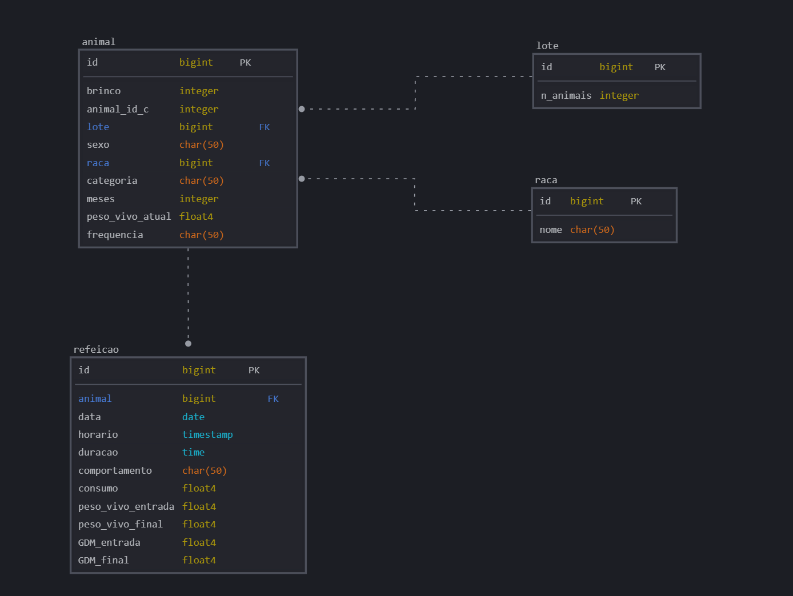

# comedouros
Comedouros automáticos
- [Referências](https://docs.google.com/spreadsheets/d/15HQGgq4hI5UT0FyafI5cfC5hrJ-wvKuH/edit?gid=41191388#gid=41191388)
- [Requisitos](https://docs.google.com/document/d/1C0blKDuB74-u4f4hb53yxRGq7Ejbn0UwOHmLEz7ay6k/edit?tab=t.0)

# schema do banco de dados


# Endpoints da api  

## Cadastro, login, e CRUD de usuários  

### (POST) '/accounts/register/': 
Cria um novo usuário.  
corpo:
```
{
    "username": nome (string),
    "email": email (string),
    "password": senha (string),
    "passwordConfirmation": senha novamente (string)
}
```

### (POST) '/accounts/api/token/'
Retorna dois JSON Web Tokens, um de access e outro de refresh (usados para autenticação).  
corpo:
```
{
    "username": nome (string),
    "password": senha (string)
}
```

### (POST) '/accounts/api/token/refresh/'
Retorna um access token novo.  
corpo:
```
{
    "refresh": refresh token
}
```

### (GET, PUT, PATCH, DELETE) '/accounts/users/<user_id>(opcional)/'
Operações de Crud sobre os usuários.  
obs: Não usar método POST para criação de usuários. Usar rota '/accounts/register/' para isso.

### (GET) '/accounts/me/'
Retorna dados sobre o usuário logado atualmente.


## CRUD de animais e refeições

## CRUD de animais e refeições

Esses endpoints permitem criar, listar, atualizar e excluir registros relacionados a **lotes**, **raças**, **animais** e **refeições**.

---

### Lotes  
**Endpoint base:** `/lotes/`  

- **(GET)** `/lotes/` – Lista todos os lotes.  
- **(POST)** `/lotes/` – Cria um novo lote.  
  **Exemplo de corpo:**
  ```json
  {
      "nome": "Lote A",
      "descricao": "Lote inicial de testes"
  }
  ```
- **(GET)** `/lotes/<id>/` – Retorna dados de um lote específico.  
- **(PUT/PATCH)** `/lotes/<id>/` – Atualiza dados de um lote.  
- **(DELETE)** `/lotes/<id>/` – Remove um lote.

---

### Raças  
**Endpoint base:** `/racas/`  

- **(GET)** `/racas/` – Lista todas as raças.  
- **(POST)** `/racas/` – Cria uma nova raça.  
  **Exemplo de corpo:**
  ```json
  {
      "nome": "Texel"
  }
  ```
- **(GET)** `/racas/<id>/` – Retorna dados de uma raça específica.  
- **(PUT/PATCH)** `/racas/<id>/` – Atualiza dados de uma raça.  
- **(DELETE)** `/racas/<id>/` – Remove uma raça.

---

### Animais  
**Endpoint base:** `/animais/`  

- **(GET)** `/animais/` – Lista todos os animais.  
- **(POST)** `/animais/` – Cria um novo animal.  
  **Exemplo de corpo:**
  ```json
  {
      "brinco": "52",
      "animal_id_c": "01_IDc",
      "sexo": "macho",
      "meses": 55,
      "categoria": "cordeiro(a)",
      "peso_vivo_atual_kg": 35.0,
      "frequencia": 3,
      "lote": 1,
      "raca": "Texel"
  }
  ```
  > Obs.: Se a raça informada não existir, ela será criada automaticamente.
- **(GET)** `/animais/<id>/` – Retorna dados de um animal específico.  
- **(PUT/PATCH)** `/animais/<id>/` – Atualiza dados de um animal.  
- **(DELETE)** `/animais/<id>/` – Remove um animal.

---

### Refeições  
**Endpoint base:** `/refeicoes/`  

- **(GET)** `/refeicoes/` – Lista todas as refeições registradas.  
- **(POST)** `/refeicoes/` – Cria uma nova refeição.  
  **Exemplo de corpo:**
  ```json
  {
      "animal": 1,
      "data_hora": "2025-08-08T10:30:00Z",
      "quantidade_kg": 2.5
  }
  ```
- **(GET)** `/refeicoes/<id>/` – Retorna dados de uma refeição específica.  
- **(PUT/PATCH)** `/refeicoes/<id>/` – Atualiza dados de uma refeição.  
- **(DELETE)** `/refeicoes/<id>/` – Remove uma refeição.
